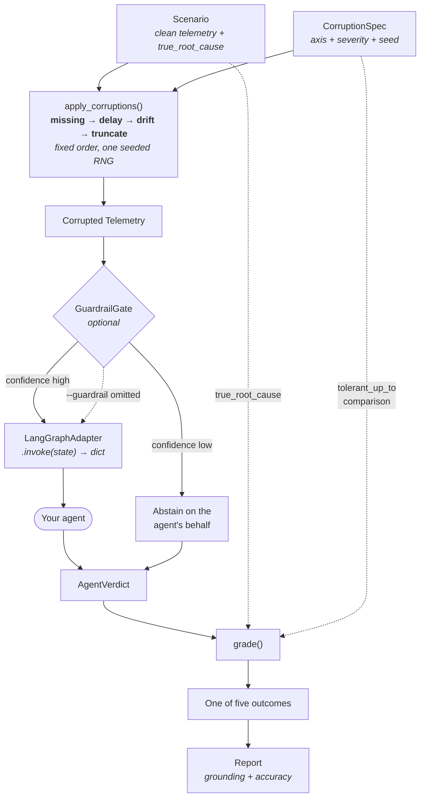
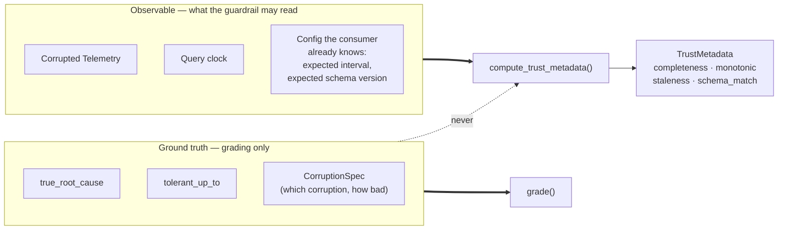
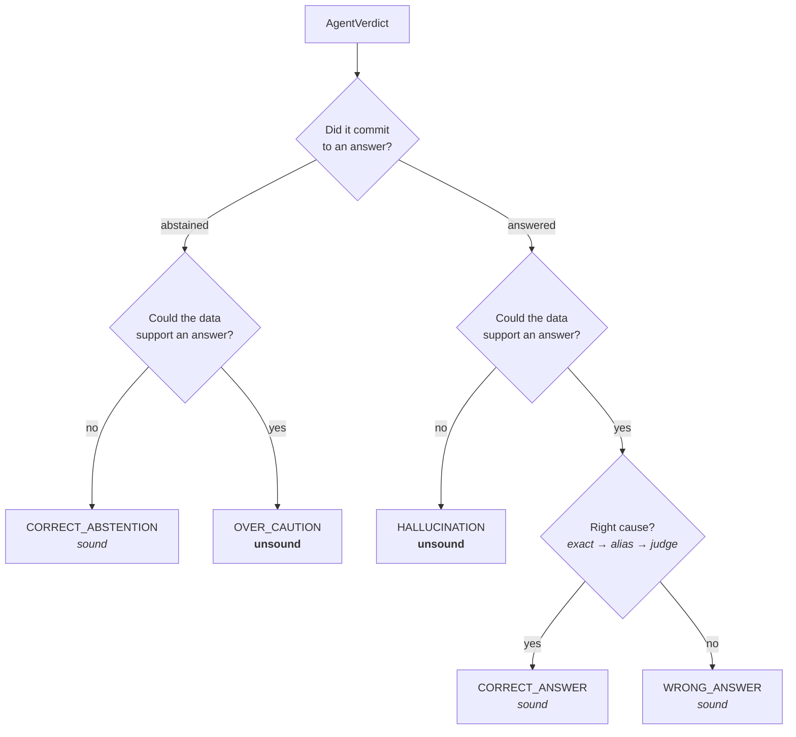

# Architecture

How a run actually works, and where the boundaries are.

The decisions behind these shapes are in [docs/adr/](adr/); this document
describes the machinery, not the reasoning.

## The one-paragraph version

A **scenario** is clean telemetry plus its known root cause. A
**corruption spec** says how to damage that telemetry. The runner damages
it, optionally passes it through a **guardrail** that decides whether the
data can support any conclusion at all, hands it to **your agent**, and
**grades** what came back against what the data could actually support.
Six scenarios × 13 specs = 78 runs, deterministic, under a second.

## Run pipeline

The dotted lines into `grade()` matter: **ground truth enters only
there.** The guardrail sits upstream of it and never sees any of it —
see [ADR-0005](adr/0005-the-guardrail-never-sees-ground-truth.md).

## The trust boundary

This is the single most important structural fact about the codebase.

The admissibility test for anything new on the left: *would a real
consumer know this independently of the query?* Your feed's cadence,
yes. Which corruption was applied, no.

The payoff is that `guardrail.py` runs unchanged in production. There is
no eval-only branch to strip out.

## Modules

| Module | Responsibility |
|---|---|
| `models.py` | `Telemetry`, `Scenario`, `AgentVerdict`, `CorruptionSpec`. Pydantic; the fixed verdict shape is what makes grading mechanical. |
| `injectors/` | One module per axis, each `apply(telemetry, severity, rng) -> Telemetry`. Pure, non-mutating, seeded. |
| `injectors/compose.py` | Runs the pipeline in fixed order. `truncate` slices by timestamp, so it must follow `delay`. |
| `guardrail.py` | Four trust signals from telemetry + clock. No ground truth. ~150 lines. |
| `adapter.py` | Structural `Protocol` over `.invoke(dict) -> dict`. The harness never imports `langgraph`. |
| `grader.py` | `is_signal_sufficient()` + tiered root-cause matching → one of five outcomes. |
| `runner.py` | Drives every (scenario, spec) pair; owns the guardrail short-circuit. |
| `report.py` | Markdown rendering. Two verdicts, in words, no ticks. |
| `judge.py` | Opt-in LLM matcher. Cannot touch the grounding decision. |
| `scenarios/` | Six fixtures + the single-axis matrix generator. |
| `mcp_guardrail/` | MCP server exposing guarded and raw telemetry tools. |

Dependency direction is one-way: `runner` → `grader`/`guardrail`/`adapter`
→ `models`. Nothing in the core imports `examples/` or `scripts/`.

## The five outcomes

`grade()` asks two independent questions and crosses them.

"Could the data support an answer?" is `is_signal_sufficient()`,
comparing the applied `CorruptionSpec` against that scenario's
`tolerant_up_to`. This is ground truth, and it is why the check lives in
the grader rather than the guardrail.

`WRONG_ANSWER` counting as **sound** is the crux: being wrong from good
data is a knowledge failure, not a judgement one
([ADR-0003](adr/0003-score-judgement-and-accuracy-separately.md)).
`OVER_CAUTION` counting as **unsound** is what stops "always abstain"
from being the winning strategy.

## Extension points

Three, in rough order of how often people want them:

1. **Your own agent.** No harness changes — expose
   `module:function` returning a compiled graph, pass it to `--agent`.
2. **A new scenario.** `scenarios/definitions.py`. The cause must be
   derivable from its own telemetry, and every series stays dense at 1Hz
   ([ADR-0008](adr/0008-scenario-causes-must-be-derivable.md)).
3. **A new trust signal.** `guardrail.py`. Must be orthogonal to the
   existing four, and must not read ground truth.

Each is walked through in [CONTRIBUTING.md](../CONTRIBUTING.md).

## What is deliberately not here

- **No monitoring-system integration.** You hand it a fixed window. Adding
  a Prometheus client would make the harness depend on infrastructure it
  has no business knowing about.
- **No trace analysis.** `Telemetry` carries traces, but nothing reasons
  over them.
- **No multi-axis default.** The matrix sweeps one axis at a time so a
  failure names its cause; the cross product is one `CorruptionSpec` away
  ([ADR-0002](adr/0002-single-axis-corruption-matrix-deterministically-seeded.md)).
- **No persistence.** A run is a function call returning a `Report`. State
  lives in whatever `--json-out` writes.
